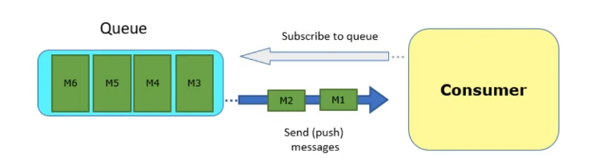

# messaging-protocols
Message Protocols Overview

## STOMP - Simple Text-Oriented Messaging Protocol
### Overview


## MQTT
### Overview


## AMQP
### Overview


### Use Case


## RabbitMQ
### [Udemy Course 1](https://www.udemy.com/course/learn-rabbitmq-asynchronous-messaging-with-java-and-spring/)
### [Udemy Course 2](https://www.udemy.com/course/rabbitmq-and-messaging-concepts/)

#### Exchange
```bash
Exchange:(Fanout, Direct, Topic, Headers, Default, Alternate)

* Fanout: Send to all Queue
* Direct: Send to queue if queue have the same routing-key
* Topic: Not require full match, check the pattern instead 
    (*): Matches exactly one word.
    "*.test" will match "check.test" but not "check.check.test" or "test.check"
    (#): Matches zero or more words.
    "test.#" will match "test.check" and "test.check.check" but not "check.test"
* Headers: Use Arguments to check message
    format header
    * Type1:
        Headers:
        {"x-match","all"}
        {"job","convert"}
        ...
        {"abc","xyz"}
    * Type2:
        Headers:
        {"x-match","any"}
        {"job","convert"}
        ...
        {"abc","xyz"}
if use headers should forcus x-match. if x-match == all then message should the same header to pass 
                                      if x-match == any then massage can the same one arguments

* Default: The same direct but dont have name and if message have rourting-key the same name queue then pass

* Alternate: Exchange rule save other message dont send to queue in other exchange (if exchange want cover miss message can add "alternate-exchange" key for an exchange ). fanout exchanges, which do not perform any filtering, are good for using as an "alternate exchange"
```

#### Push and Pull model

```bash
Push Model
* Consumer application subscribes to the queue and waits for message
* if there is already a message on the queue
* Or when a new message arrives, it is automatically sent(pushed) to the consumer application.
* this is the suggested way of getting message from a queue
```



```bash
Pull Model
* Consumer application subscribes to the queue and waits for message
* if there is already a message on the queue
* Or when a new message arrives, it is automatically sent(pushed) to the consumer application.
* this is the suggested way of getting message from a queue
```


