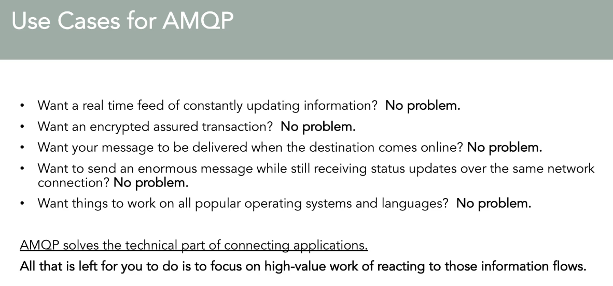

# messaging-protocols
Message Protocols Overview

[Udemy](https://www.udemy.com/course/learn-rabbitmq-asynchronous-messaging-with-java-and-spring/)
## STOMP - Simple Text-Oriented Messaging Protocol
### Overview

## MQTT
### Overview

## AMQP
### Overview

### Use Case

